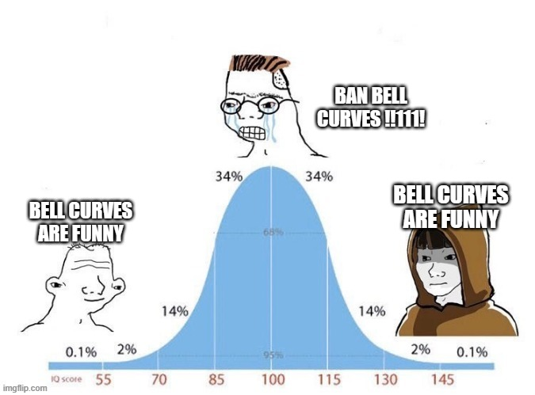
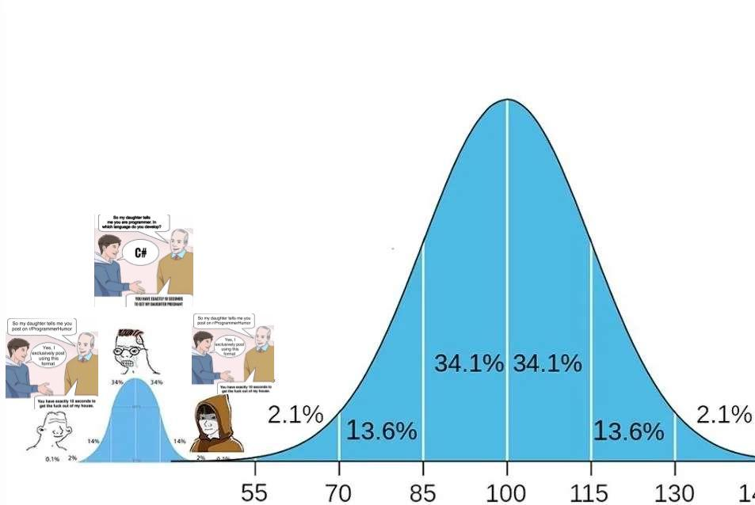
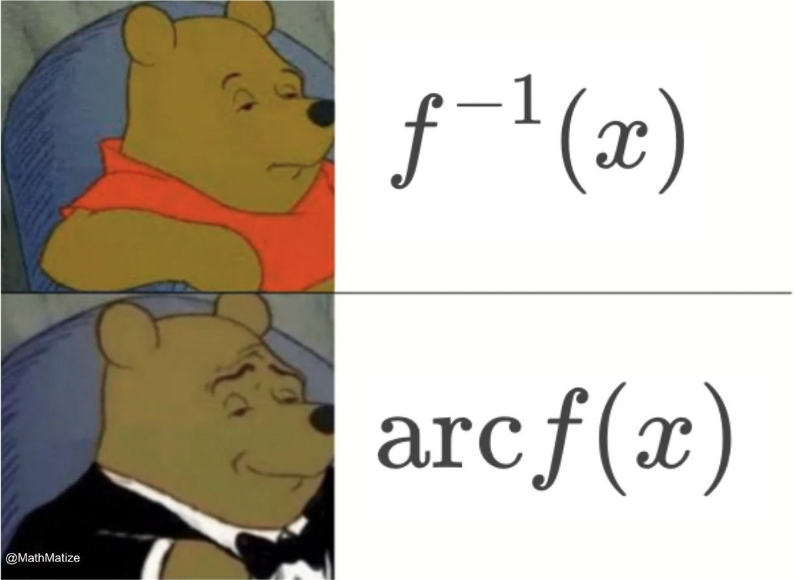
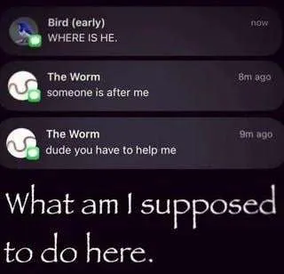
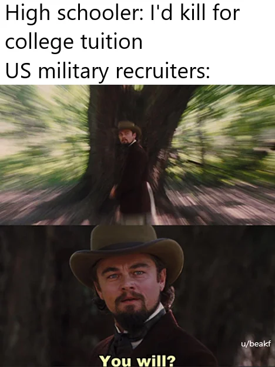
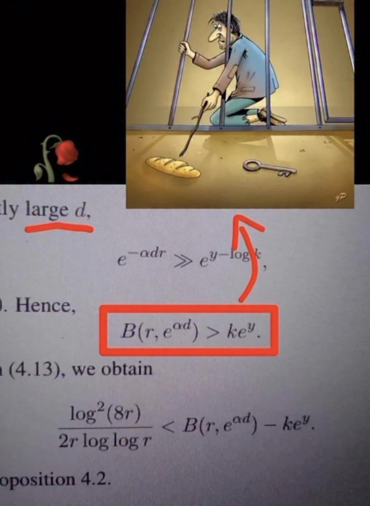
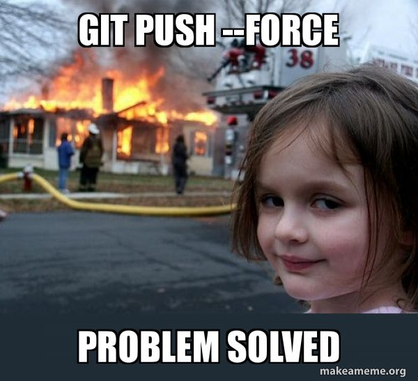

# Meme Selection Criteria

- Minimum One Image
- Usage of text

## Shortlisting ones I've found
 
Uhh, mostly not a fan of this one, could be actually funny, this meme is more about making a statement than being funny

 
This one is way better, I love making fun of people. It aptly demonstrates the problems I have with most normal distribution memes. I'm not quite sure if the small text will fill the requirements though.

This image lies, but I likes its spirit.

Pretty OK.

US military recruiter memes are always a hit even if they're basic and repetitive.

genuinely fire, and awesome, great coincidence finding the math statement when the "If you're a real philosopher you'd know bread taste better than key" meme was around.

Git meme number 1.

uhh git meme 2.

## Selection Criteria
- **100 points** : What I like more.
- **0 points** : all other possible criteria.

## Selection
$$
    b(r, e^{ad}) > ke^y
$$